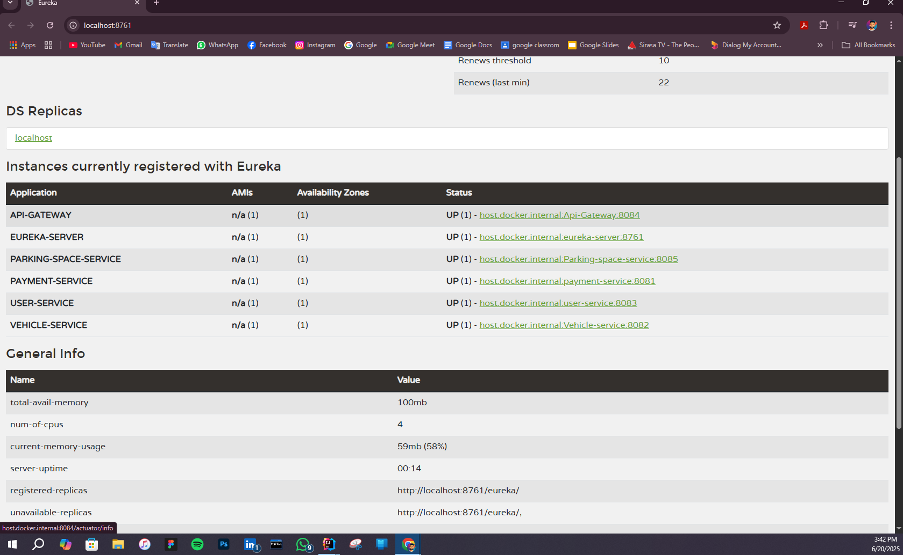

# Parking Service

## Overview
The Parking Service is a Spring Boot application that provides APIs for managing parking spots. It is registered with the Eureka server for service discovery.

## API Documentation
The Postman collection for testing the APIs is available in the project directory:
- [Postman Collection](Smart-parking-management-system-API-Collection.postman_collection.json)

## Eureka Server
Below is a screenshot of the Eureka server showing the registered services:

## Running the Application
1. Start the Eureka server.
2. Run the Parking Service application.
3. Use the Postman collection to test the APIs.
## Dependencies
- Spring Boot Starter Web
- Spring Boot Starter Data JPA
- Spring Boot Starter Eureka Client
- H2 Database (for in-memory database)
- Lombok (for reducing boilerplate code)
- Spring Boot Starter Test (for testing)

## Configuration
The application is configured to connect to an H2 in-memory database. The database configuration can be found in the `application.properties` file